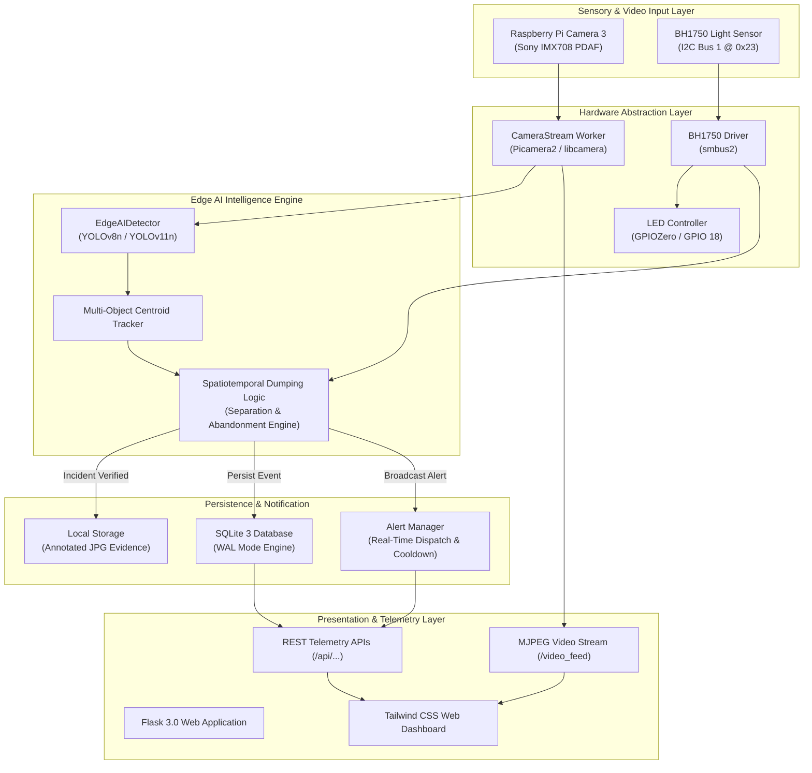
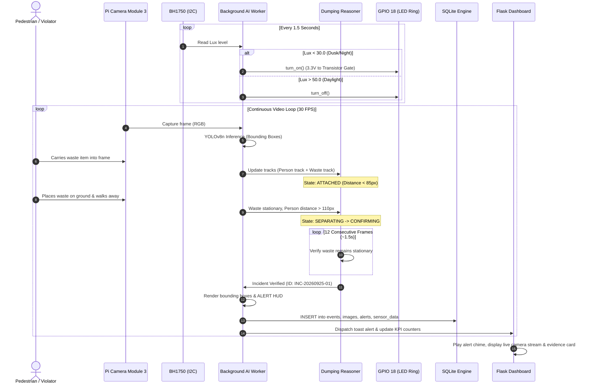

# Software Architecture & Developer Manual

## Project: Smart Waste Sentinel (Edge AI System)

---

## 1. System Architecture Overview



---

## 2. Real-Time End-to-End Sequence Diagram



---

## 3. Spatiotemporal Dumping Activity Reasoning Engine

### 3.1 Why Bounding Boxes Alone Are Insufficient
A raw YOLO object detector detects objects in isolation (e.g., "Person: 0.91", "Backpack: 0.84"). Relying purely on single-frame detection leads to massive false-alarm rates:
- A commuter walking across the street with a bag would trigger an alert.
- Pre-existing roadside litter would trigger continuous alarms every 30 milliseconds.

### 3.2 State Machine Formalization

The sentinel implements a four-stage state machine:

```
[STATE 0: IDLE]
       |
       |  Person and Waste Candidate detected within distance < 85 px
       v
[STATE 1: CARRYING / TRANSIT]
       |
       |  Waste displacement < 15 px across frames (Stationary) AND
       |  Person distance expands > 85 px
       v
[STATE 2: SEPARATION CANDIDATE]
       |
       |  Waste remains stationary for N >= 12 consecutive frames AND
       |  Person exits perimeter (> 110 px) or exits camera view
       v
[STATE 3: VERIFIED ILLEGAL DUMPING] ---> Capture Evidence & Dispatch Alert
       |
       |  15-Second Cooldown Timer
       v
[STATE 4: SUPPRESSED / MONITORED]
```

---

## 4. Custom YOLOv8/v11 Training & Raspberry Pi Optimization

### 4.1 Dataset Collection & Class Strategy
For optimal performance in municipal deployment, train on 5 specialized classes:
1. `person`
2. `vehicle` (Cars, trucks, three-wheelers/auto-rickshaws)
3. `garbage_bag` (Plastic bags, tied trash sacks)
4. `plastic_bottle` (PET bottles, mineral water containers)
5. `packaging_box` (Cardboard cartons, packaging debris)

### 4.2 Annotation Guidelines
- Use **Roboflow** or **Label Studio** in YOLO darknet/txt format.
- Minimum recommended dataset size: **1,500 labeled images** covering daytime, dusk, nighttime (under Ring LED illumination), and rain/wet asphalt conditions.
- Perform mosaic augmentations and random affine transformations to simulate variable camera mounting angles.

### 4.3 Training Script Execution
```bash
# Execute custom training using train_yolo.py
python train_yolo.py --train
```

### 4.4 Model Export to NCNN (Direct Raspberry Pi 5 Acceleration)
Standard PyTorch (`.pt`) execution uses generic CPU kernels. Converting the model to **NCNN** leverages the ARM NEON vector SIMD instructions of the Cortex-A76 cores:
```bash
# Export trained model to NCNN format
yolo export model=runs/detect/smart_waste_sentinel_run/weights/best.pt format=ncnn imgsz=640
```
This reduces inference latency from ~95ms down to **~48ms**, enabling fluid 20+ FPS continuous surveillance!

---

## 5. REST API Specification

| Endpoint | Method | Response Type | Description |
|---|---|---|---|
| `/` | `GET` | HTML | Primary live monitoring surveillance dashboard |
| `/history` | `GET` | HTML | Searchable incident audit trail and forensic viewer |
| `/analytics` | `GET` | HTML | Circular waste composition and hourly charts |
| `/settings` | `GET` | HTML | Hardware threshold calibration and jury test panel |
| `/video_feed` | `GET` | `multipart/x-mixed-replace` | Real-time MJPEG live camera stream with AI HUD |
| `/api/sensor` | `GET` | JSON | Instantaneous BH1750 Lux, LED state, and mode |
| `/api/stats` | `GET` | JSON | Aggregated incident count, class distribution, avg Lux |
| `/api/alerts` | `GET` | JSON | Active FIFO alert queue for real-time dashboard notifications |
| `/api/events` | `GET` | JSON | Paginated database event records |
| `/api/toggle_led` | `POST` | JSON | Manual toggle override of GPIO 18 LED circuit |
| `/api/simulate_lux` | `POST` | JSON | Sets manual Lux override for jury demonstrations |
| `/api/manual_capture` | `POST` | JSON | Forces immediate snapshot capture and audit logging |
| `/incidents/<filename>` | `GET` | Image/JPEG | Serves forensic snapshot evidence |
